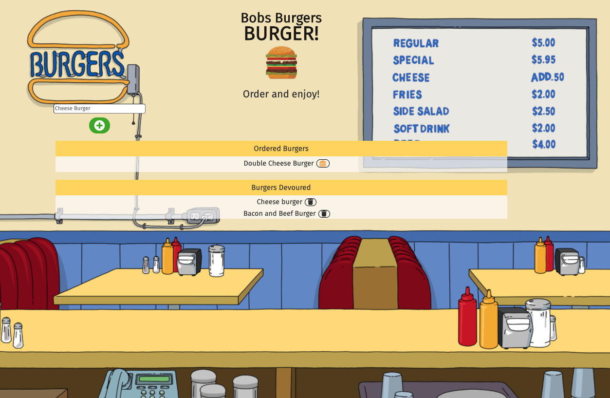

# Node Express Handlebars - BurgerApp

[](http://unlicense.org/)<br />

Within this assignment we create a burger logger with MySQL, Node, Express, Handlebars and a homemade ORM. Following the MVC design pattern by using Node and MySQL to query and route data to the app, and Handlebars to generate a HTML.

## Table of Contents

- [Table of Contents](#table-of-contents)
- [Installation](#installation)
- [Usage](#usage)
- [App Setup](#app-setup)
- [License](#license)
- [Screenshots](#screenshots)
- [Questions](#questions)

## Installation

1. Clone this GitHub repository

   ```
   git clone git@github.com:Michaelmw17/BurgerApp.git
   ```

2. Install all dependent npm packages

   ```
   npm install --save
   ```

3. Update the config/connection.js file and updated MySQL connection.

## Usage

Run `npm start` and using your web browser to access: http://localhost:8080.

A demo of the application: https://hidden-fortress-02395.herokuapp.com/

## App Setup

1. Create a GitHub repo called `burger` and clone it to your computer.

2. Make a package.json file by running `npm init` from the command line.

3. Install the Express npm package: `npm install express`.

4. Create a server.js file.

5. Install the Handlebars npm package: `npm install express-handlebars`.

6. Install MySQL npm package: `npm install mysql`.

7. Require the following npm packages inside of the server.js file:
   - express

## License

This project uses the License: Unlicense

## Screenshots



## Questions

_Michael Watt_

- [Github!](https://github.com/Michaelmw17)
- [LinkedIn!](https://www.linkedin.com/in/michael-watt-6a76961b3/)
- [Portfolio!](http://michaelmw17.github.io/)
- Email:(michaelmw17@outlook.com)
